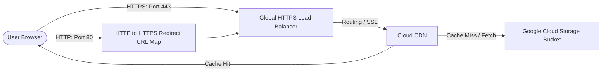

# GCP Infrastructure Hosting & Deployment Guide

This guide explains how to deploy your portfolio website onto enterprise-grade **Google Cloud Platform (GCP)** infrastructure using **Terraform (Infrastructure as Code)**.

---

## 📐 Architecture Overview

Your website will be deployed using the following secure, high-performance architecture:



### Infrastructure Components
1. **Google Cloud Storage (GCS) Bucket**: Holds all static website files (`index.html`, `assets/`, `tests/`).
2. **Cloud CDN**: Caches content globally at Google's edge POPs, enabling ultra-fast loading for Three.js files and video background files (`hero-bg.mp4`).
3. **Global External HTTPS Load Balancer**: Serves as the single entry point. Terminated with a Google-Managed SSL Certificate.
4. **HTTP-to-HTTPS Redirect Map**: Directs insecure traffic (port 80) to HTTPS (port 443) automatically.

---

## 🛠️ Step-by-Step Deployment

### 1. Prerequisites
Make sure you have the following installed on your machine:
*   [Google Cloud SDK (gcloud CLI)](https://cloud.google.com/sdk/docs/install)
*   [Terraform CLI](https://developer.hashicorp.com/terraform/tutorials/aws-get-started/install-cli)

### 2. Authenticate with Google Cloud
Open your terminal and authenticate the CLI and Terraform with your Google Account:
```bash
# 1. Login to gcloud CLI
gcloud auth login

# 2. Login to Application Default Credentials (ADC) for Terraform authentication
gcloud auth application-default login
```

### 3. Initialize GCP Project & Enable APIs
Ensure you have created a project in your [GCP Console](https://console.cloud.google.com/). Set your active CLI project and enable the required APIs:
```bash
# Set your active project ID
gcloud config set project YOUR_GCP_PROJECT_ID

# Enable Compute and Cloud Storage APIs
gcloud services enable compute.googleapis.com storage.googleapis.com
```

### 4. Configure Terraform Variables
Create a file named `terraform.tfvars` in your project root to provide variables:
```hcl
project_id  = "your-gcp-project-id"
region      = "us-central1"
domain_name = "yourdomain.com" # E.g., shiviprabhakar.com
```

### 5. Deploy Infrastructure via Terraform
Run the deployment loop:
```bash
# 1. Initialize Terraform (downloads the Google provider plugin)
terraform init

# 2. Preview the resources that will be created
terraform plan

# 3. Apply the configuration (type 'yes' when prompted)
terraform apply
```
When complete, Terraform will print the **External IP address of your Load Balancer** (`load_balancer_ip`) and the **GCS Bucket Name** (`gcs_bucket_name`).

### 6. Upload Your Website Files
Upload your local files to the newly created storage bucket:
```bash
# Sync files to the root of the bucket, excluding git data
gcloud storage rsync ./ gs://yourdomain.com --recursive --exclude-regex="^\.(git|github|terraform|gemini).*"
```

---

## 🔗 DNS Configuration (Custom Domain)

To map your custom domain (e.g., `shiviprabhakar.com`) to the GCP Load Balancer:
1. Log into your domain registrar (GoDaddy, Namecheap, Google Domains, etc.).
2. Go to the DNS settings panel.
3. Create or update the **A Record**:
   - **Host/Name**: `@`
   - **Value/IP**: The `load_balancer_ip` outputted by Terraform.
4. Create a **CNAME Record** (optional, for `www` forwarding):
   - **Host/Name**: `www`
   - **Value/Target**: `yourdomain.com`

> [!NOTE]
> Google-managed SSL certificates can take anywhere from **30 minutes to a couple of hours** to provision after you update your DNS records. The certificate status will show `PROVISIONING` until Google's CA can verify ownership via your domain A record.

---

## 🔍 Verification

Once the SSL certificate is active, verify that Cloud CDN caching and HTTP redirection are functioning correctly:

```bash
# 1. Verify HTTP redirects to HTTPS automatically
curl -I http://yourdomain.com

# 2. Check cache response headers (should show Age and x-cached headers from Google's edge cache)
curl -I https://yourdomain.com/assets/js/main.js
```
